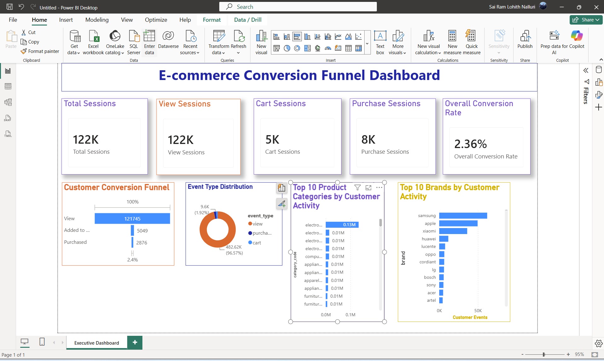
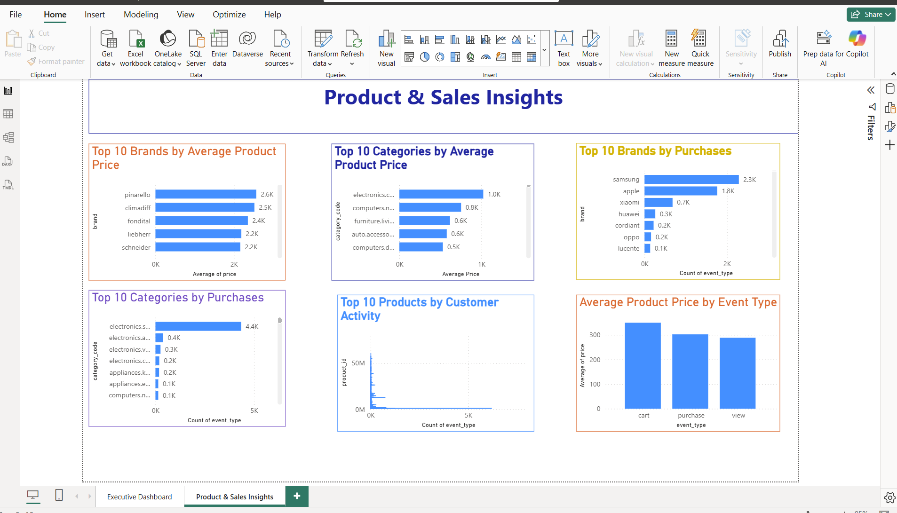

# 🛒 E-commerce Conversion Funnel Analysis

## 📌 Project Overview

This project analyzes customer behavior in an e-commerce platform to identify where users drop off during the purchasing journey. The analysis focuses on the conversion funnel from product views to completed purchases and provides actionable business insights through interactive Power BI dashboards.

---

## 🎯 Business Problem

Understanding customer behavior is essential for improving conversion rates in e-commerce.

This project answers key business questions:

- How many users progress through each stage of the conversion funnel?
- Where do customers abandon their purchasing journey?
- Which brands and product categories receive the highest customer engagement?
- Which products and categories have the highest average prices?
- What insights can help improve sales and customer conversion?

---

## 🛠 Tools & Technologies

- Python
- Pandas
- NumPy
- Jupyter Notebook
- Power BI
- DAX
- Git
- GitHub

---

## 📂 Dataset

**Source:** Kaggle – E-commerce Behavior Dataset

The dataset contains customer interaction events including:

- 👀 View
- 🛒 Cart
- ✅ Purchase

---

# 📊 Dashboard

## Executive Dashboard

Features:

- Total Sessions
- View Sessions
- Cart Sessions
- Purchase Sessions
- Overall Conversion Rate
- Customer Conversion Funnel
- Event Type Distribution
- Top Product Categories
- Top Brands

### Dashboard Preview



---

## Product & Sales Insights

Features:

- Top 10 Brands by Average Product Price
- Top 10 Categories by Average Product Price
- Top 10 Brands by Purchases
- Top 10 Categories by Purchases
- Top Products by Customer Activity
- Average Product Price by Event Type

### Dashboard Preview



---

# 📈 Key Insights

- Most customer sessions end after viewing products.
- Only a small percentage of users complete a purchase.
- Samsung and Apple receive the highest customer engagement.
- Smartphone-related categories dominate customer activity.
- Premium brands have significantly higher average selling prices.
- Customer purchasing behavior varies across product categories.

---

# 💡 Business Recommendations

- Improve product pages to increase Add-to-Cart rate.
- Optimize the checkout process to reduce purchase abandonment.
- Promote high-performing brands through targeted campaigns.
- Cross-sell complementary products to increase cart value.
- Focus marketing efforts on high-performing product categories.

---

# 📁 Repository Structure

```
Ecommerce-Conversion-Funnel-Analysis
│
├── dashboard
│   └── Ecommerce_Conversion_Funnel.pbix
│
├── data
│   ├── ecommerce_cleaned.csv
│   └── ecommerce_sample.csv
│
├── images
│   ├── ExecutiveDashboard.png
│   └── ProductInsights.png
│
├── notebooks
│   └── ecommerce_funnel_analysis.ipynb
│
└── README.md
```

---

# 🚀 How to Run

1. Clone this repository.
2. Open the Jupyter Notebook to explore the data preparation and analysis.
3. Open the Power BI (.pbix) file to interact with the dashboards.

---
## 📁 Repository Structure

```
Ecommerce-Conversion-Funnel-Analysis
│
├── dashboard
│   └── Ecommerce_Conversion_Funnel.pbix
│
├── data
│   ├── ecommerce_cleaned.csv
│   └── ecommerce_sample.csv
│
├── images
│   ├── ExecutiveDashboard.png
│   └── ProductInsights.png
│
├── notebooks
│   └── ecommerce_funnel_analysis.ipynb
│
└── README.md
```
# 👨‍💻 Author

**Sai Ram Lohith Nalluri**

Data Analyst | Python | SQL | Power BI | Excel

---

⭐ If you found this project useful, consider giving the repository a star.
